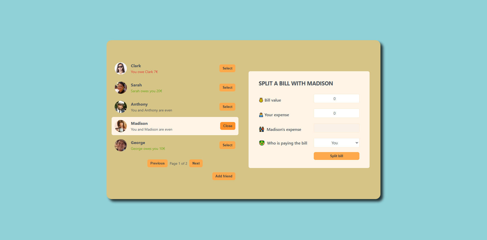

# _FAIR SHARE_

- **DESCRIPTION :**

  Welcome to FairShare, the ultimate app for tracking shared expenses and settling up with friends. Whether you're splitting a restaurant bill, sharing rent, or tracking group expenses, FairShare makes it easy to keep everything fair and transparent. No more awkward conversations about who owes what—FairShare does the math for you, so you can focus on enjoying the moment. With intuitive features and a user-friendly interface, managing shared expenses has never been easier. Start using FairShare today and experience the simplicity of fair splitting!

---

- **STACK :**

  - **Fair Share** : `0.6.0`
  - **React** : `18.3.1`
  - **React Dom** : `18.3.1`

---

- **URLS :**

  - **Website : [Fair Share](https://dagt-fair-share.netlify.app)**

---

- **CREDITS :**

  - **Author : [David Gómez](https://github.com/DavidGomezToca)**